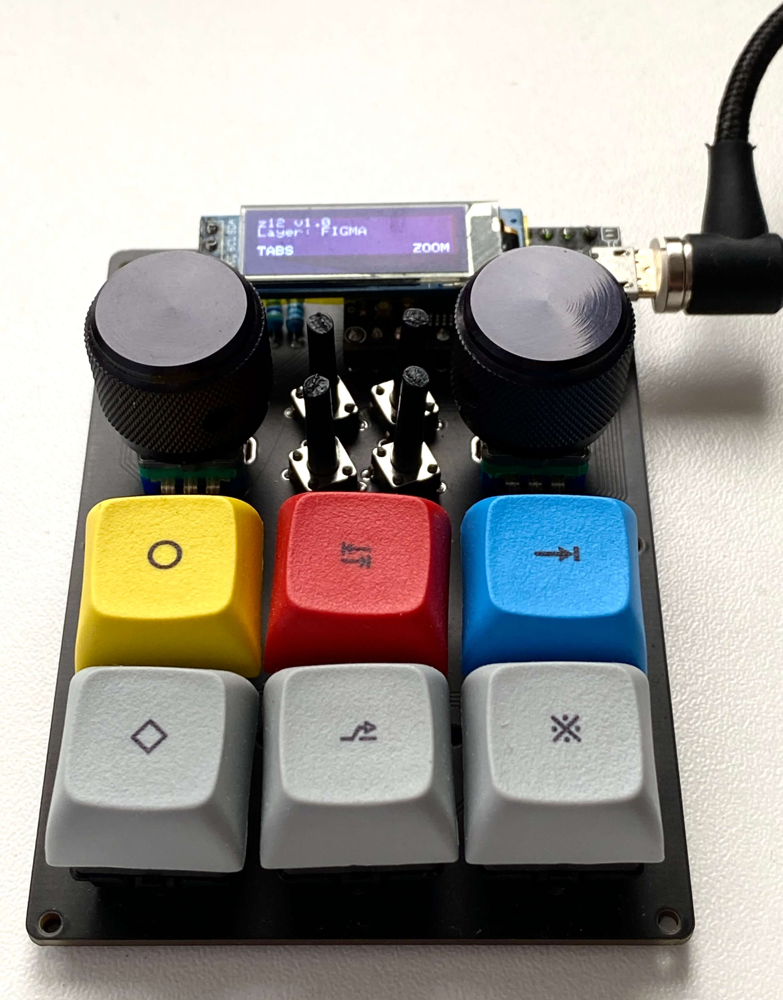
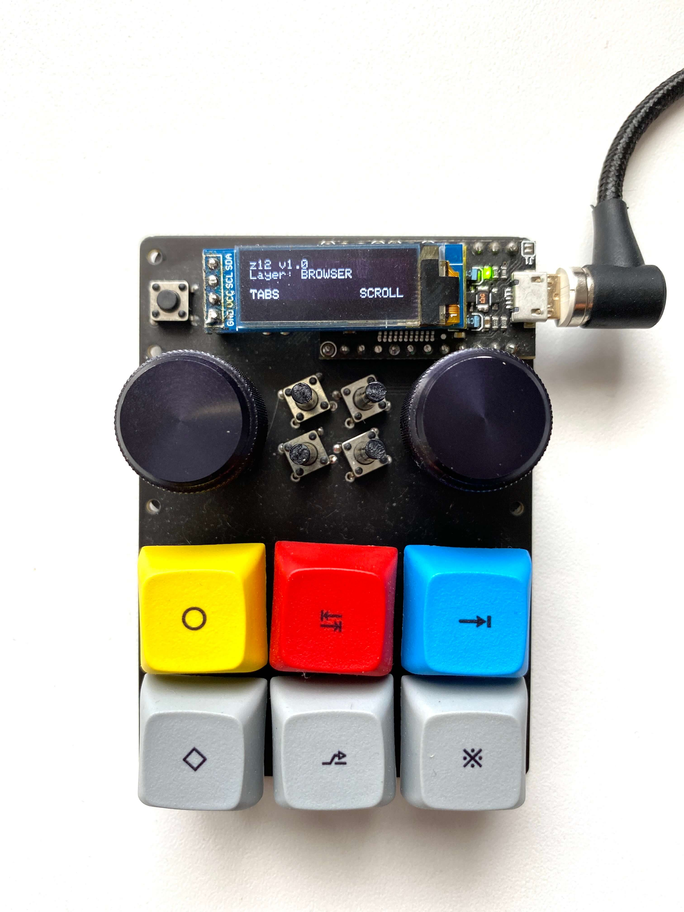
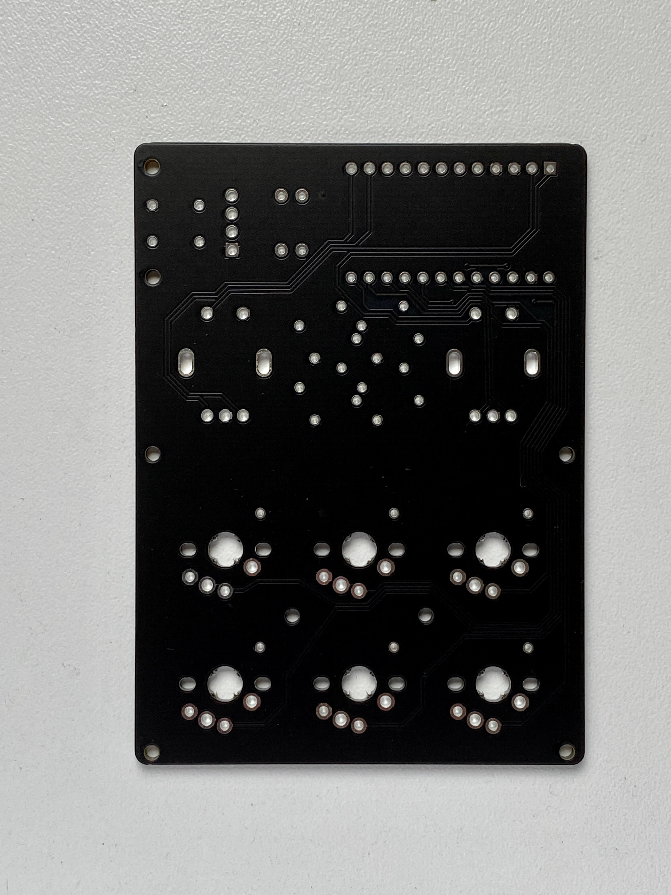
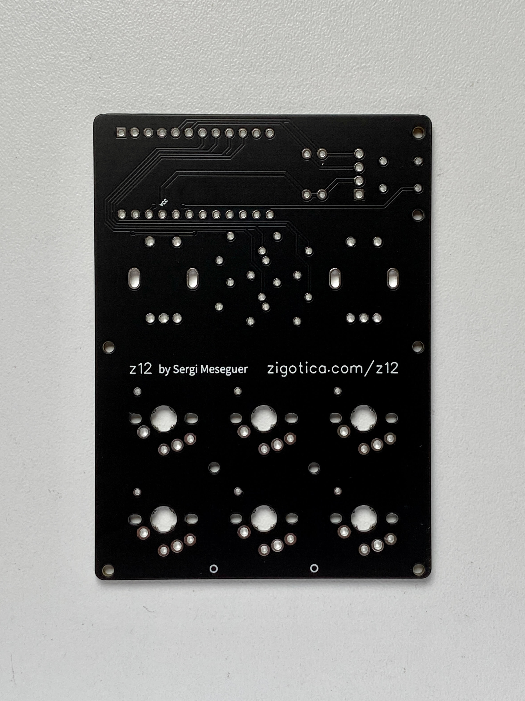

# z12

## Description
The z12 is a mechanical micropad with 6x MX/Choc v1&v2 switches, 4x 6x6mm momentary buttons, 2x EC11 rotary encoders and 1x 128x32 OLED display. It uses no diodes.

## Main use
This layout allows me to configure shortcuts and rotary encoder actions for several apps (i.e. sketch, terminal, browser, ...).

## Images
See high res pictures clicking the images on this gallery:

## Build
You can build your own pad using the gerber shared in this repo. Just zip the folder and send to your favourite online shop. I use [JLCPCB](https://jlcpcb.com/) and quality is really nice for the cost (and that black matte is gorgeous). No plate has been designed yet (misalignments are really visible in the images above, due to the fact I used 3 pin switches), but it is under development. 
