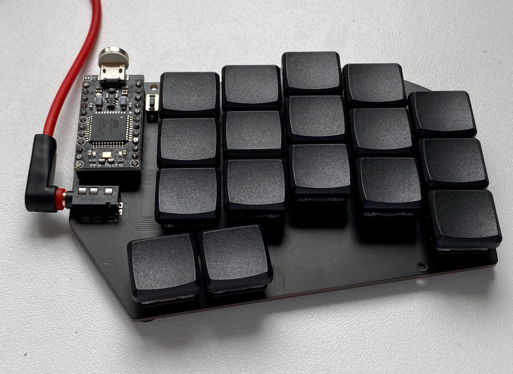
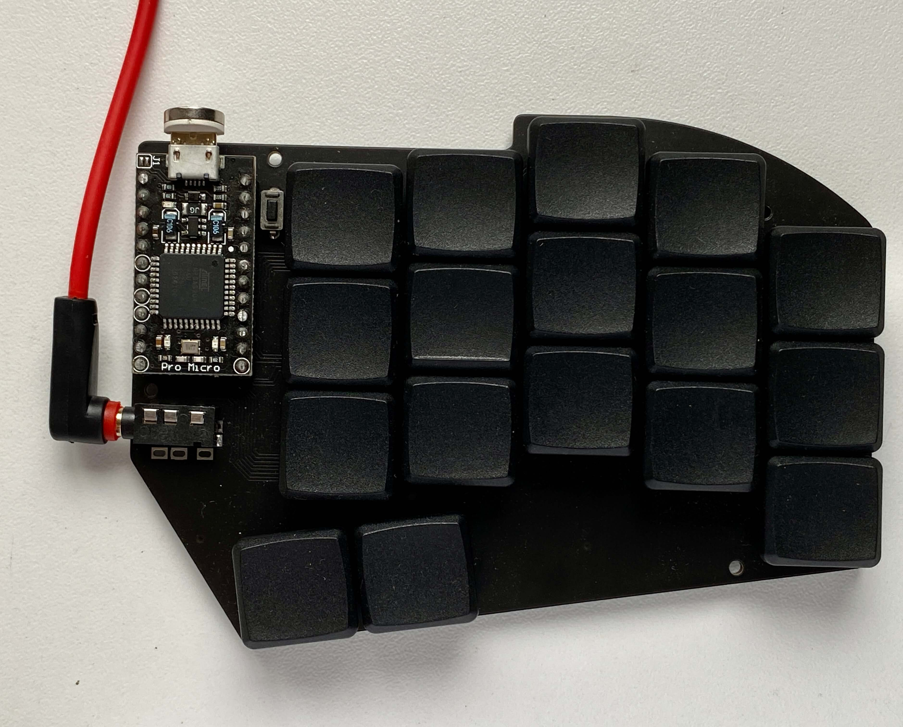
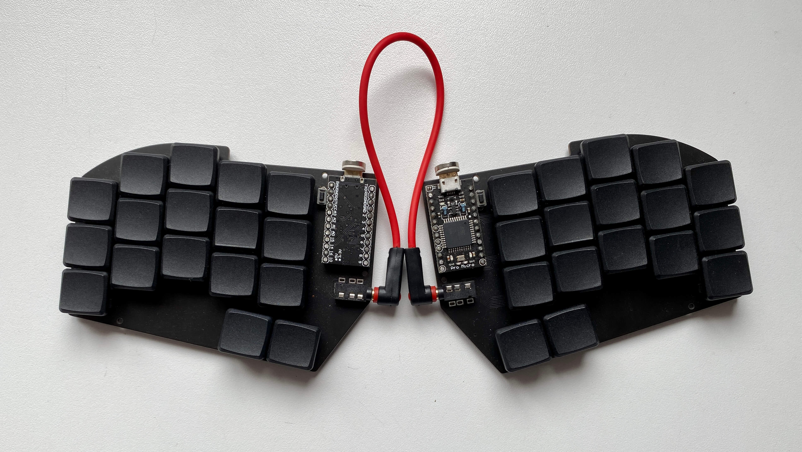
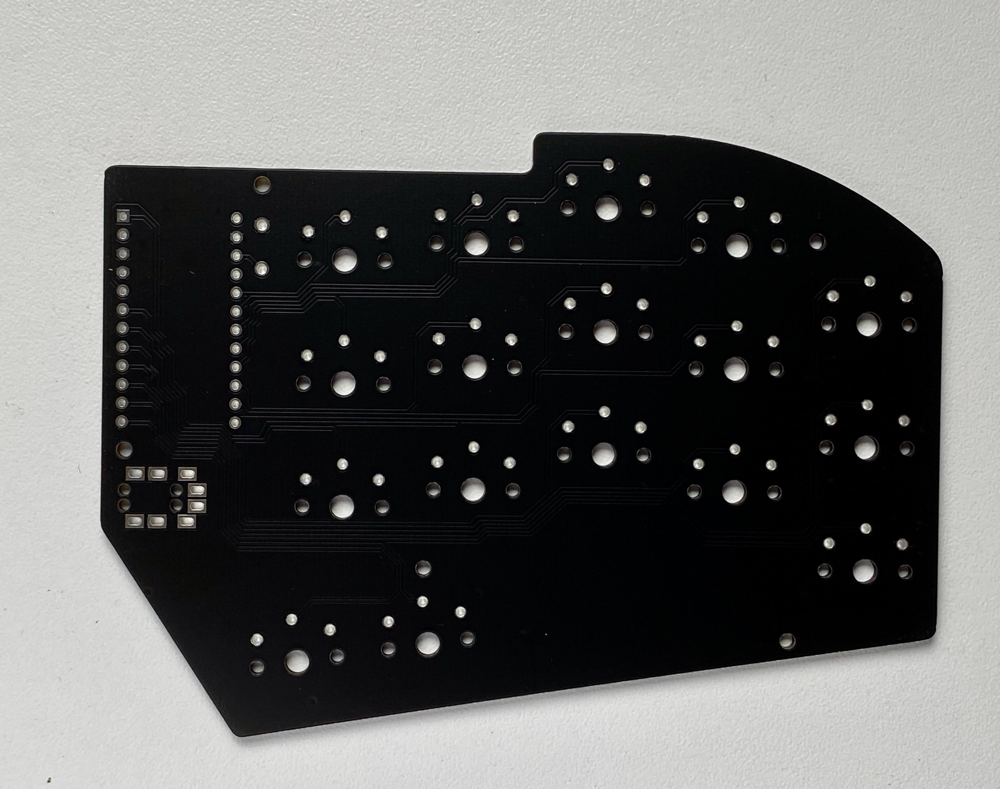
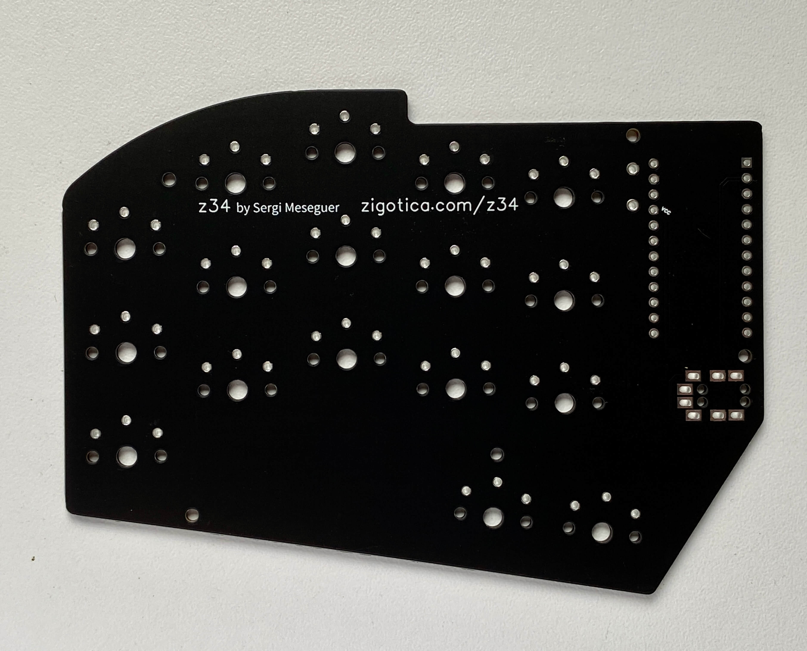

# z34

## Description
The z34 is a split mechanical keyboard with 34x Choc v1 switches, distributed in a "3x5 + 2 thumbs per hand" layout. It is heavily inspired by the Ferris (34 keys and no diodes), but created this one to be able to use a Pro Micro instead of ARM chips.

## Images
See high res pictures clicking the images on this gallery:

## Build
You can build your own keyboard using the gerber shared in this repo. Just zip the folder and send to your favourite online shop. I use [JLCPCB](https://jlcpcb.com/) and quality is really nice for the cost (and that black matte is gorgeous). You simply have to solder the Pro Micro and the switches. No plate has been designed yet, but using 5 pin switches makes it unnecessary. Reset button is optional (you can short the pins in the micro directly to flash the firmware).
